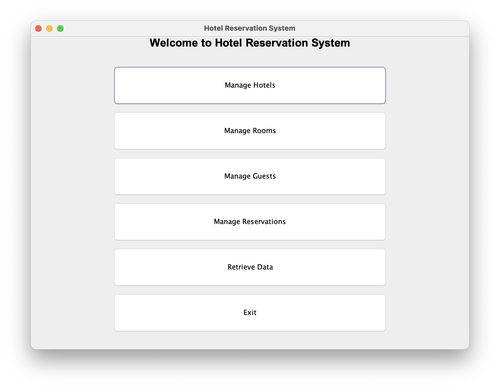
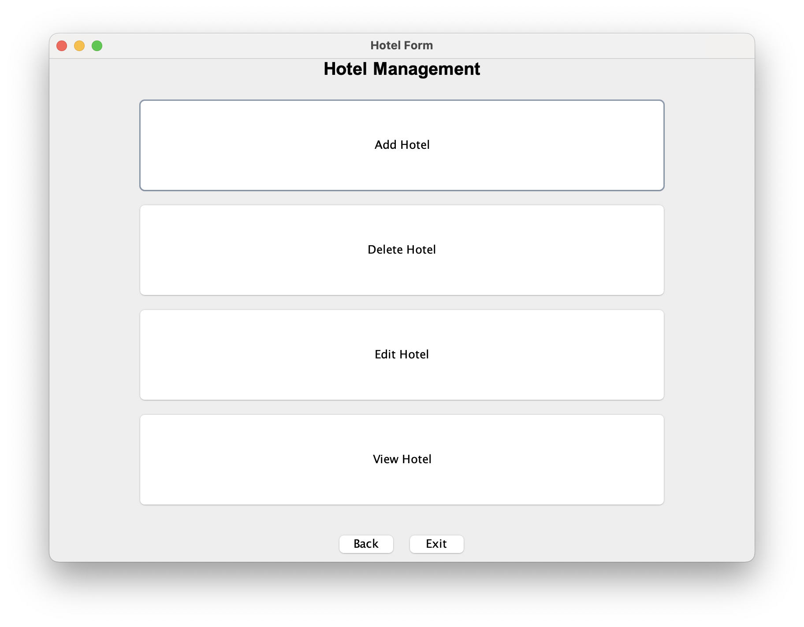
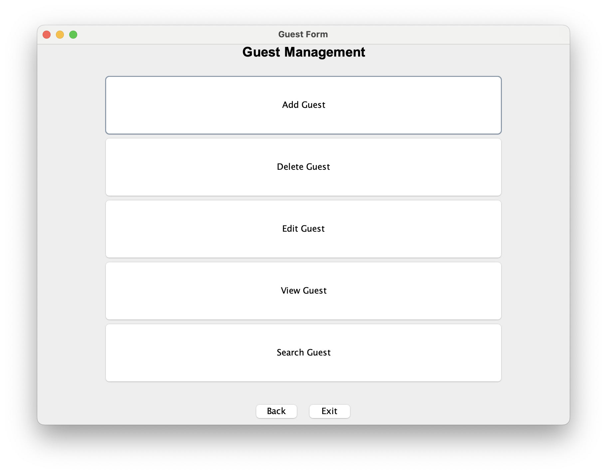
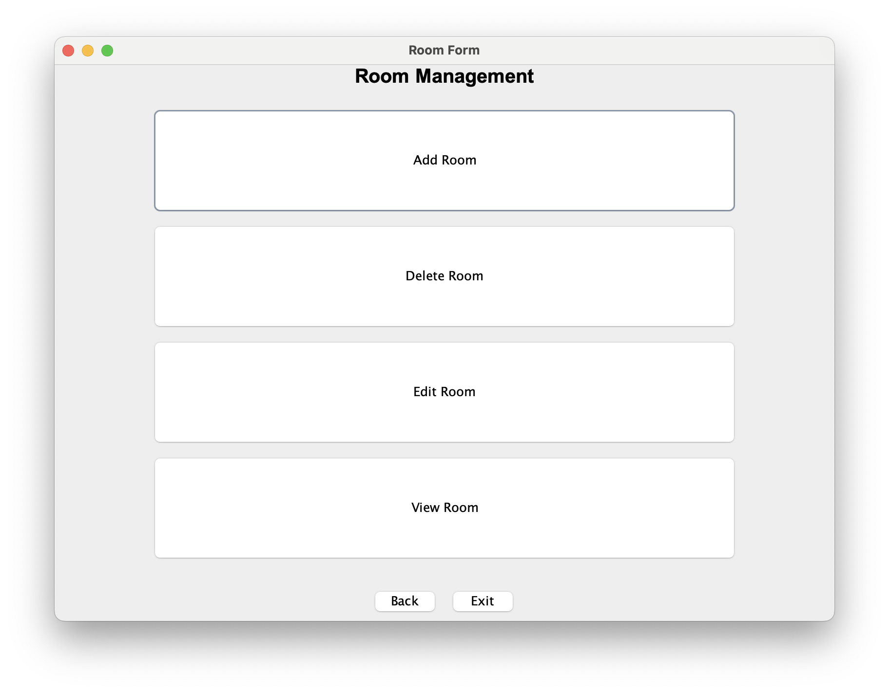
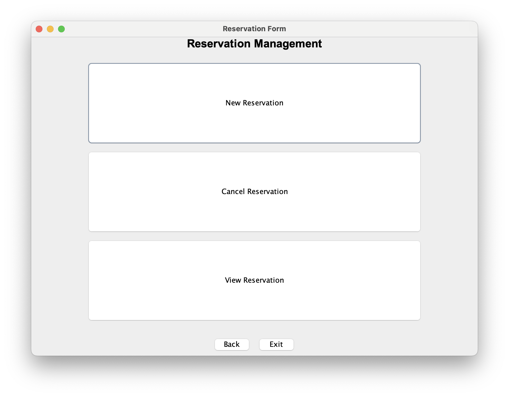
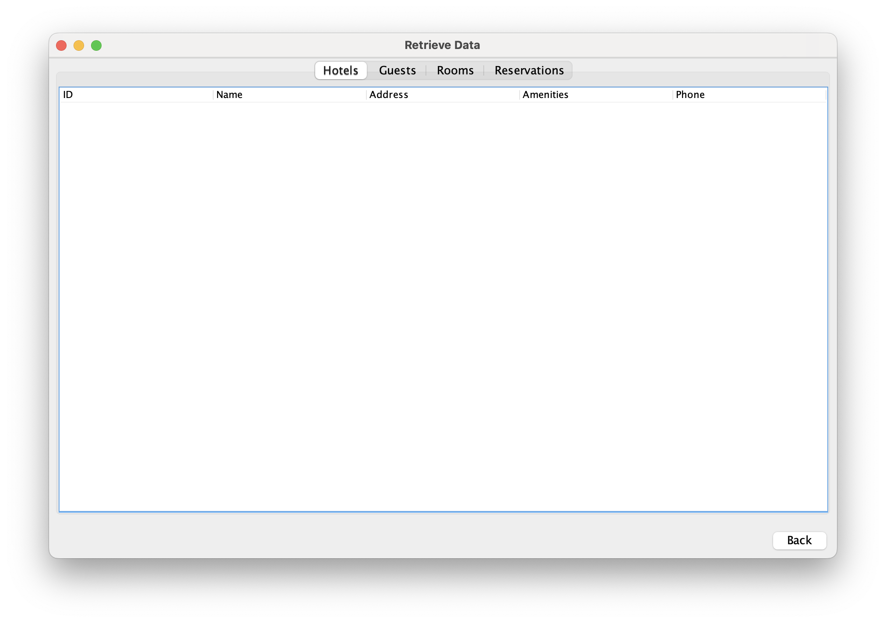

# 🏨 Hotel Reservation System (Java Swing + MySQL)

This is a project that I was assigned to make during my Internshala Core Java Internship Training. This is a desktop-based Hotel Reservation System built using **Core Java (Swing)** for GUI, **MySQL** for backend database, and **JDBC** for connectivity. It allows hotel admins to manage guests, rooms, reservations, and hotel data efficiently.

---

## 🚀 Features

- ✅ Add, View, Edit, Delete for:
    - Hotels
    - Rooms
    - Guests
    - Reservations
- ✅ Search Guests by Name
- ✅ Retrieve Data Dashboard (with tabs for each entity)
- ✅ Pagination support for large datasets
- ✅ Input Validation for all forms
- ✅ Modular DAO Architecture
- 🛠️ Future Support for:
    - Export to CSV
    - Login System
    - FlatLaf UI Enhancement

---

## 🛠️ Technologies Used

| Component | Tech |
|----------|------|
| GUI      | Java Swing |
| Backend  | MySQL |
| ORM      | JDBC |
| IDE      | IntelliJ IDEA / Eclipse |
| Language | Java 17+ |

---

## 🗃️ Database Schema (MySQL)

Tables: `hotels`, `rooms`, `guests`, `reservations`
> Foreign keys link rooms to hotels and reservations to guests/rooms

```sql
CREATE TABLE hotels (
  id INT AUTO_INCREMENT PRIMARY KEY,
  name VARCHAR(100),
  address TEXT,
  amenities TEXT,
  phone VARCHAR(15)
);

CREATE TABLE guests (
  id INT AUTO_INCREMENT PRIMARY KEY,
  name VARCHAR(100),
  email VARCHAR(100),
  phone VARCHAR(15)
);

CREATE TABLE rooms (
  id INT AUTO_INCREMENT PRIMARY KEY,
  hotel_id INT,
  room_number INT,
  type VARCHAR(50),
  price DOUBLE,
  status VARCHAR(20),
  FOREIGN KEY (hotel_id) REFERENCES hotels(id)
);

CREATE TABLE reservations (
  id INT AUTO_INCREMENT PRIMARY KEY,
  guest_id INT,
  room_id INT,
  check_in_date DATE,
  check_out_date DATE,
  total_price DOUBLE,
  FOREIGN KEY (guest_id) REFERENCES guests(id),
  FOREIGN KEY (room_id) REFERENCES rooms(id)
);
```

---

## 🔧 Setup Instructions

1. **Clone the repo**:
   ```bash
   git clone https://github.com/your-username/hotel-reservation-system.git
   ```

2. **Create MySQL DB**:  
   Create a database named `hospitality_db` and run the SQL schema above.

3. **Configure DB Connection**:  
   Update your JDBC URL, username, and password in `DatabaseConnector.java`.

4. **Run the project** from `MainFrame.java`.

---

## 📸 Screenshots

### 🔷 Main Menu (Dashboard)


### 🧾 Hotel Form


### 🧾 Guest Form


### 🧾 Room Form


### 🧾 Reservation Form


### 📋 Retrieve Data View


---

## 🤝 Contributing

Have ideas or want to improve the project? Fork and submit a pull request!

---

## 📜 License

MIT License – use freely for educational and personal purposes.

---

## 👨‍💻 Developed by

**Harshdeep Bishnoi**  
*Core Java + Swing + MySQL Project*